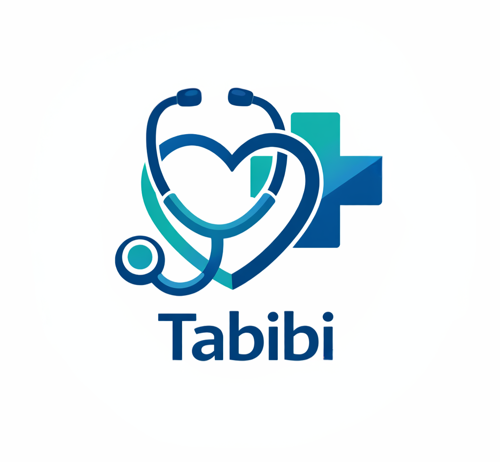

<div align="center">



# 🏥 طبيبي — Tabibi

### منصة الرعاية الصحية الذكية

[](https://flutter.dev)
[](https://dart.dev)
[](https://firebase.google.com)
[](LICENSE)

</div>

---

## 📖 نبذة عن التطبيق

**طبيبي (Tabibi)** هو تطبيق صحي شامل يهدف إلى تسهيل التواصل بين المرضى والأطباء في اليمن. يتيح التطبيق للمرضى حجز المواعيد، والاستشارة الطبية عن بُعد، ومتابعة سجلاتهم الطبية بكل سهولة ويسر، بينما يمنح الأطباء أدوات احترافية لإدارة عياداتهم ومرضاهم.

---

## ✨ المميزات الرئيسية — أصحاب المصلحة

### 👤 المريض (Patient)
- 🔍 **البحث عن أطباء** متخصصين حسب التخصص والموقع والتقييم
- 📅 **حجز المواعيد** بسهولة وتلقي تأكيد فوري
- 💬 **الاستشارة عن بُعد** نصياً وصوتياً ومرئياً
- 📋 **السجل الطبي الرقمي** متابعة التاريخ المرضي والوصفات والتحاليل
- 👨‍👩‍👧 **ملفات العائلة** إدارة السجلات الصحية لجميع أفراد الأسرة
- 🔔 **الإشعارات الفورية** تذكيرات المواعيد ونتائج الفحوصات
- 🗺️ **خرائط تفاعلية** لتحديد مواقع العيادات والصيدليات والمختبرات
- ⭐ **تقييم مقدمي الخدمة** ومشاركة التجارب
- 🆘 **طلب الطوارئ** بضغطة واحدة مع تحديد الموقع تلقائياً

### 🩺 الطبيب (Doctor)
- 📊 **لوحة تحكم احترافية** ملخص يومي للمواعيد والاستشارات والدخل
- 📅 **تقويم ذكي** لإدارة المواعيد وأوقات العمل والإجازات
- 👥 **إدارة قائمة المرضى** وعرض سجلاتهم الطبية الكاملة
- 💊 **إصدار الوصفات الرقمية** وإرسالها مباشرةً للصيدلية
- 💻 **الاستشارات عن بُعد** نصية وصوتية ومرئية
- 📈 **إحصائيات وتقارير** شاملة عن أداء العيادة والدخل

### 🛡️ الأدمن — الإدارة العليا (Admin)
- 👨‍⚕️ **إدارة جميع المستخدمين** (مرضى، أطباء، صيدليات، مختبرات، طوارئ)
- ✅ **توثيق وموافقة الحسابات** المهنية قبل تفعيلها
- 📦 **إدارة المحتوى** (المقالات الصحية، الأسئلة الشائعة)
- 💰 **إدارة المدفوعات والعمولات** وتسوية الحسابات
- 📊 **لوحة KPIs شاملة** لمتابعة أداء المنصة بالكامل
- 🚨 **إدارة الشكاوى والدعم الفني** وحل النزاعات

### 💊 الصيدلية (Pharmacy)
- 📜 **استقبال الوصفات الرقمية** من الأطباء مباشرةً
- 📦 **إدارة المخزون** ومراقبة الأدوية القاربة على النفاذ
- 🚚 **خدمة التوصيل** للمنازل ضمن نطاق جغرافي محدد
- 🔔 **إشعار المرضى** بحالة الوصفة (قيد التجهيز / جاهزة / تم الصرف)
- 📊 **إحصائيات الطلبات** والوصفات الواردة والمعالجة

### 🚨 خدمات الطوارئ والإسعاف (Emergency Services)
- 🗺️ **خريطة حية** لعرض مواقع البلاغات وسيارات الإسعاف المتاحة
- ⚡ **استقبال البلاغات الفورية** مع الموقع الجغرافي الدقيق للمريض
- 🏥 **الوصول لملف المريض الطبي** (فصيلة الدم، الأمراض المزمنة) لحظياً
- 🚑 **تعيين سيارة إسعاف** بضغطة زر وتتبع مسارها
- 📞 **التواصل المباشر** مع المريض أو جهات الاتصال الطارئة
- 🔄 **تحديث حالة البلاغ** (قيد المعالجة / تم الوصول / تم النقل / مغلق)

### 🔬 المختبرات ومراكز الأشعة (Labs & Radiology)
- 📋 **استقبال طلبات الفحص** من الأطباء والمرضى
- 📤 **رفع النتائج** (PDF أو صورة) وإرسالها مباشرةً للمريض والطبيب
- 🔔 **إشعار فوري** عند اكتمال النتائج
- 🏠 **خدمة الزيارة المنزلية** لأخذ العينات (إذا كانت متاحة)
- 📊 **إدارة الطلبات** (جديد / قيد المعالجة / النتائج جاهزة / تم التسليم)

---

## 🛠️ التقنيات المستخدمة

### الإطار والبرمجة
| التقنية | الوصف |
|---------|--------|
| **Flutter 3.x** | إطار تطوير التطبيق متعدد المنصات |
| **Dart 3.x** | لغة البرمجة الأساسية |

### الخدمات السحابية (Firebase)
| الخدمة | الاستخدام |
|--------|-----------|
| **Firebase Auth** | تسجيل الدخول والمصادقة |
| **Cloud Firestore** | قاعدة البيانات الرئيسية |
| **Firebase Storage** | تخزين الصور والملفات |
| **Firebase Messaging** | الإشعارات الفورية (Push) |

### المكتبات الأساسية
| المكتبة | الغرض |
|---------|--------|
| `provider` | إدارة الحالة (State Management) |
| `go_router` | التنقل بين الشاشات |
| `dio` | طلبات الشبكة HTTP |
| `google_maps_flutter` | الخرائط التفاعلية |
| `geolocator` | تحديد الموقع الجغرافي |
| `cached_network_image` | تحميل الصور بكفاءة |
| `hive_flutter` | التخزين المحلي السريع |
| `lottie` | الرسوم المتحركة |
| `google_fonts` | خطوط احترافية |
| `flutter_animate` | تأثيرات بصرية سلسة |

---

## 📁 هيكل المشروع

```
tabibi/
├── lib/
│   ├── core/
│   │   ├── constants/            # الثوابت والألوان والنصوص
│   │   ├── routes/               # إعداد التنقل (GoRouter)
│   │   ├── theme/                # الثيمات والأنماط البصرية
│   │   └── utils/                # أدوات مساعدة
│   ├── data/
│   │   ├── models/               # ✅ نماذج البيانات (19 نموذج)
│   │   │   ├── models.dart       # ملف التجميع — استورد منه الكل
│   │   │   ├── user_model.dart           # 👤 المستخدم (جميع الأدوار)
│   │   │   ├── family_member_model.dart  # 👨‍👩‍👧 فرد العائلة
│   │   │   ├── medical_record_model.dart # 📋 السجل الطبي
│   │   │   ├── doctor_model.dart         # 🩺 الطبيب
│   │   │   ├── specialty_model.dart      # 🏥 التخصصات الطبية
│   │   │   ├── facility_model.dart       # 🏢 المستشفى / العيادة
│   │   │   ├── appointment_model.dart    # 📅 الحجوزات
│   │   │   ├── consultation_model.dart   # 💬 الاستشارات
│   │   │   ├── chat_message_model.dart   # 📨 رسائل الدردشة
│   │   │   ├── pharmacy_model.dart       # 💊 الصيدلية
│   │   │   ├── prescription_model.dart   # 📜 الوصفات الطبية
│   │   │   ├── lab_model.dart            # 🔬 المختبر / الأشعة
│   │   │   ├── lab_test_request_model.dart # 🧪 طلبات الفحوصات
│   │   │   ├── emergency_model.dart      # 🚨 بلاغات الطوارئ
│   │   │   ├── ambulance_model.dart      # 🚑 سيارات الإسعاف
│   │   │   ├── notification_model.dart   # 🔔 الإشعارات
│   │   │   ├── review_model.dart         # ⭐ التقييمات
│   │   │   ├── payment_model.dart        # 💳 المدفوعات
│   │   │   └── article_model.dart        # 📰 المقالات الصحية
│   │   ├── repositories/         # طبقة الوصول للبيانات
│   │   └── services/             # خدمات Firebase والـ API
│   ├── presentation/
│   │   ├── screens/              # شاشات التطبيق
│   │   │   ├── auth/             # تسجيل الدخول والاشتراك
│   │   │   ├── patient/          # 👤 شاشات المريض
│   │   │   ├── doctor/           # 🩺 شاشات الطبيب
│   │   │   ├── admin/            # 🛡️ شاشات الإدارة العليا
│   │   │   ├── pharmacy/         # 💊 شاشات الصيدلية
│   │   │   ├── emergency/        # 🚨 شاشات الطوارئ والإسعاف
│   │   │   └── lab/              # 🔬 شاشات المختبرات والأشعة
│   │   ├── widgets/              # المكونات القابلة لإعادة الاستخدام
│   │   └── providers/            # مزودو الحالة (Provider)
│   └── main.dart                 # نقطة البداية
├── assets/
│   ├── images/                   # الصور
│   ├── icons/                    # الأيقونات
│   ├── fonts/                    # خطوط Cairo
│   ├── animations/               # ملفات Lottie
│   └── data/                     # البيانات الثابتة (JSON)
├── pubspec.yaml
└── README.md
```

---

## 🚀 كيفية تشغيل المشروع

### المتطلبات الأساسية
- ✅ Flutter SDK `^3.8.1`
- ✅ Dart SDK `^3.8.1`
- ✅ Android Studio / VS Code
- ✅ حساب Firebase مفعّل

### خطوات التشغيل

```bash
# 1. استنساخ المشروع
git clone https://github.com/your-username/tabibi.git
cd tabibi

# 2. تثبيت الحزم
flutter pub get

# 3. إعداد Firebase
# ضع ملف google-services.json داخل android/app/
# ضع ملف GoogleService-Info.plist داخل ios/Runner/

# 4. تشغيل التطبيق
flutter run
```

### إعداد أيقونة التطبيق
```bash
# بعد وضع app_icon.png في assets/icons/
flutter pub run flutter_launcher_icons
```

---

## 📱 المنصات المدعومة

| المنصة | الحالة |
|--------|--------|
| ✅ Android | مدعوم |
| ✅ iOS | مدعوم |
| 🔄 Web | قيد التطوير |

---

## 🔐 الأمان والخصوصية

- 🔒 تشفير كامل للبيانات المنقولة عبر HTTPS
- 🛡️ قواعد أمان Firestore لحماية بيانات المستخدمين
- 🔑 مصادقة متعددة الطبقات عبر Firebase Auth
- 📵 عدم مشاركة البيانات الطبية مع أطراف ثالثة

---

## 🗂️ المتغيرات البيئية

أنشئ ملف `.env` في جذر المشروع وأضف:
```env
GOOGLE_MAPS_API_KEY=your_api_key_here
```

---

## 🤝 المساهمة في التطوير

هذا مشروع خاص وغير مفتوح للمساهمة العامة حالياً.

---

## 📄 الترخيص

هذا المشروع محمي بحقوق الملكية الفكرية. جميع الحقوق محفوظة © 2026

---

<div align="center">

## 👨‍💻 المطوّر

<br>

**م. وليد العنسي**

مطور تطبيقات الجوال | Flutter Developer

<br>

📞 **للتواصل والطلب:**

[](https://wa.me/967773157823)

<br>

> *"نحو رعاية صحية رقمية أفضل في اليمن"*

<br>


</div>
